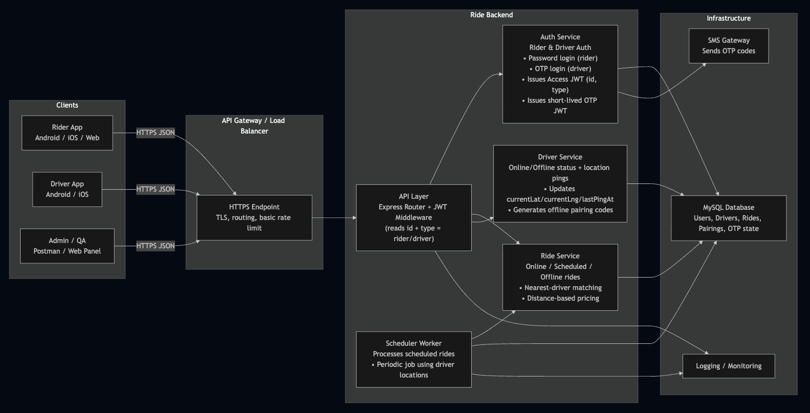

# Ride Simulator

Node.js/TypeScript Express API simulating a ride-sharing platform with riders, drivers, OTP-based auth, and online/offline/scheduled rides backed by MySQL via Sequelize.

## Overview

Express v1 API (`src/app.ts` / `src/server.ts`) with layered **controllers → services → repos → Sequelize models**.

Core flows:

-   Rider password login (email/phone + password) → JWT (type = `rider`)
-   Driver OTP login (phone + OTP) → JWT (type = `driver`)
-   Stateless OTP verification using a short-lived signed JWT (`otpToken`)
-   Ride creation & matching:
    -   **Online rides** (nearest online driver based on live location)
    -   **Scheduled rides** (matched by a background worker at `scheduledAt`)
    -   **Offline rides** (driver generates paring code, ride logged after trip)
-   Driver online/offline status & location pings (every few seconds)
-   Fare calculation (distance-based)

## Features

### Authentication

-   Single `users` table with `type` = `rider` / `driver`
-   **Rider auth**
    -   Register with phone/email + password
    -   Login with **email or phone** + password
    -   Issues access JWT: `{ id, type: "rider", exp, iat }`
-   **Driver auth**
    -   Register with phone/email (no password)
    -   Request OTP → backend generates a 6-digit code, signs a short-lived **OTP JWT** (`otpToken`), and logs the code (simulating SMS)
    -   Verify OTP → `{ phone, code, otpToken }` → on success issues access JWT `{ id, type: "driver", ... }`
-   All protected routes use a **JWT middleware** that:
    -   Verifies the access JWT
    -   Attaches `req.user = { id, type }`
    -   Controllers enforce rider-only or driver-only access based on `type`

### Driver Online / Offline & Location

-   `PATCH /api/v1/drivers/me/status` – driver toggles online/offline
    -   Updates `isOnline` + `lastPingAt`
-   `PATCH /api/v1/drivers/me/location` – driver app sends location every few seconds
    -   Updates `currentLat`, `currentLng`, `lastPingAt`
-   When matching rides, the backend **never trusts `isOnline` alone**:
    -   Only drivers with `isOnline = true` and `lastPingAt` within a recent window (e.g. last 3 minutes) are considered
    -   If app crashes or network dies and pings stop, the driver automatically stops receiving rides

### Rides

-   **Online rides**
    -   Rider creates an online ride with pickup/dropoff coordinates
    -   Service calculates:
        -   Distance (Haversine)
        -   Fare (base fare + per-km rate, with minimum fare)
    -   Matches nearest suitable driver using live driver locations (`currentLat`, `currentLng`, `lastPingAt`)
    -   Status transitions:
        -   `REQUESTED → ASSIGNED → ACCEPTED → STARTED → COMPLETED`
        -   Cancellations: `CANCELLED_BY_RIDER`, `CANCELLED_BY_DRIVER`
-   **Scheduled rides**
    -   Rider creates ride with future `scheduledAt`
    -   Stored as `type = SCHEDULED`, `status = REQUESTED`
    -   Background worker periodically runs `processDueScheduledRides()`:
        -   Finds due scheduled rides
        -   Uses the same **nearest-driver** logic as online rides
-   **Offline rides**
    -   Driver generates an **offline paring code** (short-lived, stored in DB)
    -   Rider (or call center) creates an offline ride with that code
    -   Backend validates paring, marks the code as used, and records the ride as:
        -   `type = OFFLINE`
        -   `status = COMPLETED` (logged after trip)
        -   `paymentStatus = PAID`

### Pricing & Ride Code

-   Simple distance-based pricing:
    -   `price = baseFare + perKmRate * distanceKm` (clamped to a minimum fare)
-   For every ride:
    -   `price` is persisted in the `rides` table
    -   `rideCode` is generated from the DB id (e.g. `RIDE-000123`) and exposed to clients

### Architecture

The project uses a clean layered structure:

-   **Controller layer** (`src/web/controller/v1`)
    -   HTTP endpoints, Joi validation, mapping request → service input
-   **Service layer** (`src/service`)
    -   Business logic (auth, OTP, matching, pricing, status transitions)
    -   No direct Sequelize usage
-   **Repository layer** (`src/repo`)
    -   All DB access via Sequelize models + `Op`
    -   Repos hide queries from services
-   **Models** (`src/model`)
    -   Sequelize model definitions for `User`, `Driver`, `Ride`, `OfflineParing`, etc.

## System Design



-   **Clients**: Rider app, Driver app
-   **API Gateway / Load Balancer**: TLS termination, routing, basic rate limiting (conceptual; not implemented, but shown for production-ready design)
-   **Ride Backend (Node.js + Express + TypeScript)**:
    -   API Layer with JWT middleware
    -   Auth Service, Ride Service, Driver Service, Scheduler Worker
-   **Infrastructure**:
    -   MySQL database (users, drivers, rides, paring codes)
    -   SMS gateway (simulated via console logs)
    -   Logging / monitoring

## Requirements

-   Docker & Docker Compose
-   Node.js 22+ and Yarn (only if you plan to run lint/tests outside containers)

## Running the API

### Docker Compose (recommended)

```bash
docker-compose up --build
```

-   Spins up the API, MySQL 8, and phpMyAdmin.
-   Compose uses `Dockerfile.dev` (live reload). For a production image, build with `Dockerfile` instead: `docker build -f Dockerfile -t ride-simulator:prod .`
-   API: [http://localhost:3000/api/v1](http://localhost:3000/api/v1)
-   phpMyAdmin: [http://localhost:8080](http://localhost:8080) or [http://0.0.0.0:8080/index.php](http://0.0.0.0:8080/index.php) (user `admin`, password `admin`)
-   MySQL credentials match `docker-compose.yml` (`admin`/`admin`, db `ride_sharing`).

### Local (host Node, optional)

```bash
yarn install
yarn dev
```

Defaults for ports/DB live in `src/config/config.ts`; override via env vars when needed.

## Testing

> Optional: requires `yarn install` on the host. Run outside Docker for faster feedback.

```bash
yarn test --runInBand
```

Coverage artifacts are emitted under `coverage/`.

## Postman Collection

-   Import `assets/ride-simulator.postman_collection.json` and `assets/ride-simulator.postman_environment.json` into Postman.
-   Set environment values:
    -   `HOST` → your API base URL (e.g. `http://localhost:3000/api/v1`).
    -   `rider-access-token` / `driver-access-token` → fill after logging in to hit protected routes.
-   Collection includes driver register/OTP/login and rider auth flows with example payloads.

## Useful Scripts

| Command                     | Description                                   |
| --------------------------- | --------------------------------------------- |
| `yarn dev`                  | Run API with nodemon (ts-node)                |
| `yarn build`                | Compile TypeScript to `dist/`                 |
| `yarn start`                | Run compiled server from `dist/`              |
| `yarn prod`                 | Build then start (`yarn build && yarn start`) |
| `yarn test`                 | Jest suite with coverage                      |
| `yarn lint`                 | Type check + ESLint with auto-fix             |
| `docker-compose up --build` | Full stack (API + MySQL + phpMyAdmin)         |
